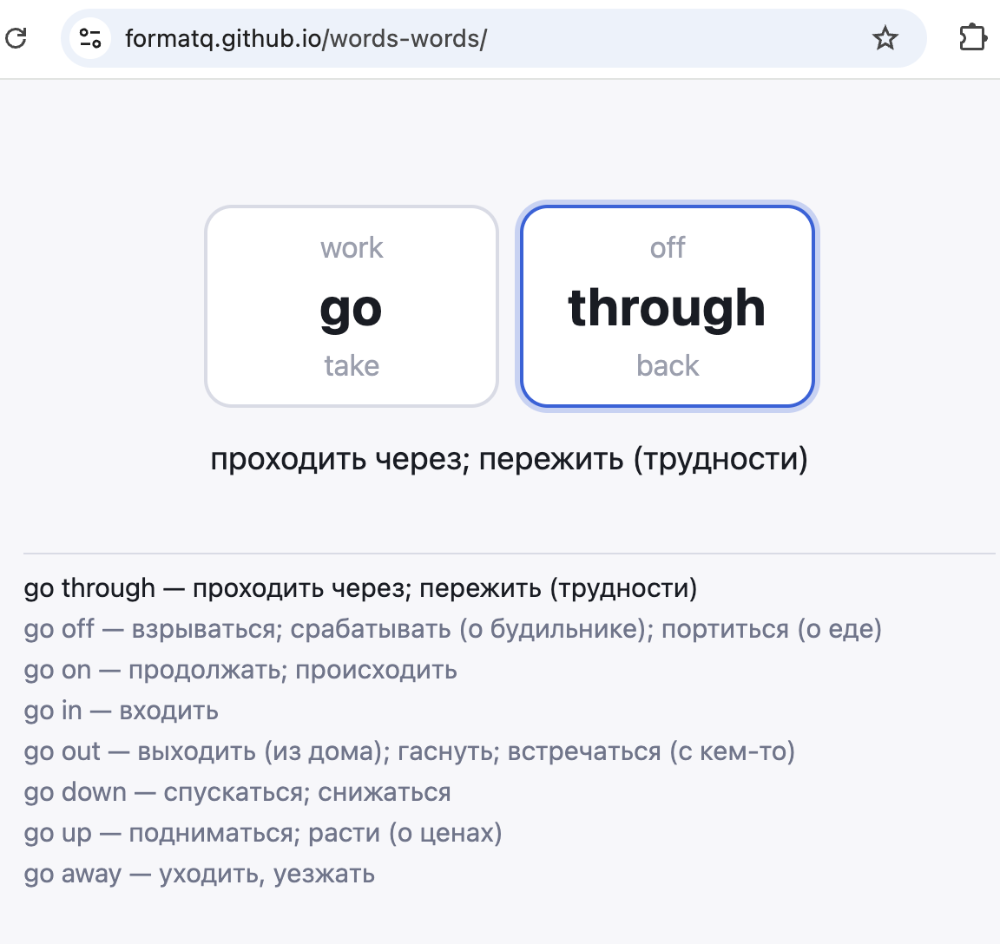

# words-words

Phrasal verb trainer: two "wheels" (verb + particle), instant switching with a Russian translation. The full spec and future ideas live in [SPEC.md](SPEC.md).

## UI


## Commands

```bash
npm install
npm run dev      # dev server (http://localhost:5173)
npm test         # unit tests (vitest)
npm run build    # type check + production build into dist/
```

## Controls

- `←` / `→` — pick a wheel, `↑` / `↓` — spin it (key auto-repeat works)
- mouse wheel over a wheel spins it, click activates it
- on mobile: tap a wheel and swipe vertically

Spinning skips non-existent combinations: every stop is a real phrasal verb.

## Data

`src/data/phrasal-verbs.json` — 30 verbs × 18 particles, 271 combinations with Russian translations. Dataset invariants are checked by a unit test and at startup in dev mode.
